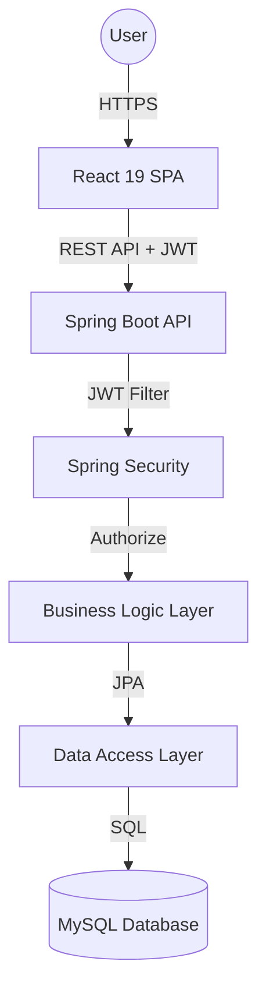
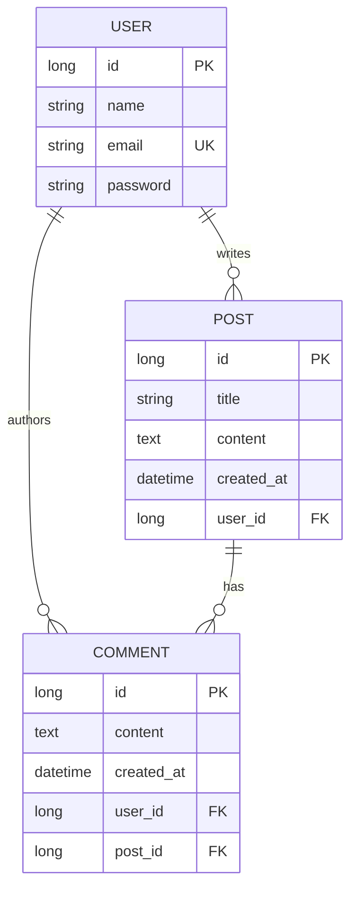

# 📝 Blogging Platform Full-Stack Application


A high-performance, secure, and modern full-stack blogging platform. This application features a robust **Spring Boot 3** backend following the Controller-Service-Repository pattern and a dynamic **React 19** frontend powered by **Vite 6**.

---

---

## 🚀 Live Deployment

The application is fully deployed and accessible online. It utilizes a multi-cloud architecture for optimal performance:

*   **🌐 Live Demo (Frontend):** [https://blogging-platform-fullstack-client.vercel.app/](https://blogging-platform-fullstack-client.vercel.app/)
*   **⚙️ API Server (Backend):** [Hosted on Render](https://blogging-platform-fullstack-6iw9.onrender.com/api/posts)
*   **🗄️ Database:** MySQL hosted on Railway

*(Note: Since the backend is hosted on Render's free tier, the API may take 30-50 seconds to spin up if it hasn't received traffic recently. Please be patient on the initial load!)*

---

## 🌟 Key Features

### 🔐 Security & Auth
- **JWT Authentication**: Stateless authentication using JSON Web Tokens.
- **Secure Password Hashing**: Industry-standard **BCrypt** encoding for sensitive data.
- **Protected API Endpoints**: Role-based and ownership-based access control.
- **Session Persistence**: Secure token storage in `localStorage` with automatic expiry handling.

### ✍️ Content Management
- **Full CRUD Operations**: Create, Read, Update, and Delete blog posts.
- **Rich Post Details**: View full content with author metadata and timestamps.
- **Ownership Validation**: Only authors can modify or delete their own posts.
- **Dynamic Search & Filter**: Real-time post filtering and sorting (Latest/Oldest).

### 💬 Engagement
- **Interactive Comment System**: Users can comment on posts to foster community engagement.
- **Nested Relationships**: Seamless mapping between Users, Posts, and Comments.

### 🎨 User Experience
- **Responsive UI**: Optimized for Mobile, Tablet, and Desktop.
- **Glassmorphic Design**: Modern aesthetics with blur effects and gradients.
- **Micro-animations**: Smooth transitions using **Framer Motion**.
- **Loading Skeletons**: Enhanced perceived performance during data fetching.

---

## 🛠️ Tech Stack Deep Dive

### **Frontend Architecture**
The frontend is built with **React 19**, utilizing the latest features for better performance and smaller bundle sizes.
- **Routing**: `React Router 7` for seamless client-side navigation.
- **State Management**: `Context API` for Authentication and Global State.
- **API Communication**: `Axios` with custom interceptors for automatic token injection and error handling.
- **Visuals**: `React Icons` and `React Loading Skeleton` for a premium feel.

### **Backend Architecture**
The backend follows a layered architecture to ensure separation of concerns.
- **Core**: `Spring Boot 3.2.4` with `Java 17`.
- **Security**: `Spring Security` with custom `JwtFilter` for bearer token validation.
- **Database Layer**: `Spring Data JPA` with `Hibernate` for ORM mapping.
- **Data Transfer**: `Lombok` for boilerplate reduction and `DTO` pattern for API consistency.

---

## 📐 System Architecture



---

## 🗄️ Database Schema Design

The database is normalized to ensure data integrity and efficient querying.



---

## 📂 Project Structure Detailed

```text
blogging-platform/
├── client/                 # React Frontend (Vite)
│   ├── src/
│   │   ├── components/     # Reusable UI Components (Navbar, PostCard, etc.)
│   │   ├── context/        # Auth & Global State management
│   │   ├── pages/          # View Components (Home, Login, Register, CreatePost)
│   │   ├── services/       # API layer with Axios Interceptors
│   │   ├── utils/          # Formatting helpers and constants
│   │   └── App.jsx         # Main Routing configuration
│   └── vercel.json         # Deployment configuration for Vercel
├── server/                 # Spring Boot Backend
│   ├── src/main/java/
│   │   └── com.blog.bloggingplatform/
│   │       ├── config/     # Security, JWT, and CORS Configuration
│   │       ├── controller/ # REST Endpoints mapping
│   │       ├── dto/        # Request and Response Objects
│   │       ├── model/      # JPA Database Entities
│   │       ├── repository/ # Spring Data JPA Interfaces
│   │       ├── service/    # Business logic implementation
│   │       └── BloggingPlatformApplication.java
│   └── Dockerfile          # Multi-stage Docker build for Render/Railway
└── database/               # Database Scripts
    └── schema.sql          # Initial DB Schema and Seed Data
```

---

## 🚦 API Documentation

### **Auth Endpoints**
| Method | Endpoint | Description | Payload | Access |
| :--- | :--- | :--- | :--- | :--- |
| `POST` | `/api/auth/register` | User signup | `{name, email, password}` | Public |
| `POST` | `/api/auth/login` | User login | `{email, password}` | Public |

### **Post Endpoints**
| Method | Endpoint | Description | Access |
| :--- | :--- | :--- | :--- |
| `GET` | `/api/posts` | Fetch all posts | Public |
| `GET` | `/api/posts/{id}` | Fetch a single post | Public |
| `POST` | `/api/posts` | Create a new post | Private |
| `PUT` | `/api/posts/{id}` | Update existing post | Private (Owner) |
| `DELETE` | `/api/posts/{id}` | Delete a post | Private (Owner) |

### **Comment Endpoints**
| Method | Endpoint | Description | Access |
| :--- | :--- | :--- | :--- |
| `GET` | `/api/comments/post/{id}`| Fetch comments for a post | Public |
| `POST` | `/api/comments` | Add a new comment | Private |

---

## 🚀 Local Installation & Setup

### **Prerequisites**
- **Node.js**: v20 or higher
- **JDK**: 17 or higher
- **Maven**: 3.8+
- **MySQL**: 8.0+

### **1. Clone the Repository**
Start by cloning the project to your local machine:
```bash
git clone https://github.com/your-username/blogging-platform.git
cd blogging-platform
```

### **2. Database Setup**
1. Open your MySQL terminal or GUI (Workbench/Sequel Ace).
2. Run the following command:
   ```sql
   CREATE DATABASE blog_db;
   ```
3. Execute the contents of `database/schema.sql` to setup tables and seed data.

### **3. Backend Setup**
1. Navigate to the server folder:
   ```bash
   cd server/blogging-platform
   ```
2. Configure `src/main/resources/application.properties` with your DB credentials.
3. Build and Run:
   ```bash
   mvn clean install
   mvn spring-boot:run
   ```

### **4. Frontend Setup**
1. Navigate to the client folder:
   ```bash
   cd client
   ```
2. Install dependencies:
   ```bash
   npm install
   ```
3. Configure `.env` file:
   ```env
   VITE_API_URL=http://localhost:8080/api
   ```
4. Start development:
   ```bash
   npm run dev
   ```

---

## 🌐 Deployment Strategy

### **Database (Railway)**
- Deploy a MySQL instance on [Railway](https://railway.app/).
- Use the generated `MYSQL_URL` as your `DB_URL` environment variable.

### **Backend (Render)**
- Set up a **Web Service** on [Render](https://render.com/).
- Set **Root Directory** to `server/blogging-platform`.
- Use the provided **Dockerfile** for automatic building.
- Set environment variables: `DB_URL`, `DB_USER`, `DB_PASS`, `JWT_SECRET`.

### **Frontend (Vercel)**
- Connect GitHub repo to [Vercel](https://vercel.com/).
- Set **Root Directory** to `client`.
- Add `VITE_API_URL` pointing to your Render backend.

---

## 🛡️ Security Implementation Details
- **Password Protection**: Uses `BCryptPasswordEncoder` with a strength of 10.
- **JWT Flow**: 
  1. User logs in → Server generates a signed JWT.
  2. Client stores JWT in `localStorage`.
  3. Client sends JWT in the `Authorization: Bearer <token>` header for protected requests.
  4. Server `JwtFilter` validates the token on every request.

---

## 🤝 Contributing
Contributions are what make the open-source community such an amazing place to learn, inspire, and create. Any contributions you make are **greatly appreciated**.

1. Fork the Project.
2. Create your Feature Branch (`git checkout -b feature/AmazingFeature`).
3. Commit your Changes (`git commit -m 'Add some AmazingFeature'`).
4. Push to the Branch (`git push origin feature/AmazingFeature`).
5. Open a Pull Request.

---

## 📜 License
Distributed under the MIT License. See `LICENSE` for more information.

---

## ⭐ Support & Contact
If you found this project helpful, please give it a **Star** 🌟 on GitHub!

**Author**: [Your Name]
**Email**: [Your Email]
**GitHub**: [github.com/your-username](https://github.com/your-username)
**LinkedIn**: [linkedin.com/in/your-profile](https://linkedin.com/in/your-profile)

---
*Built with ❤️ for the Developer Community.*
